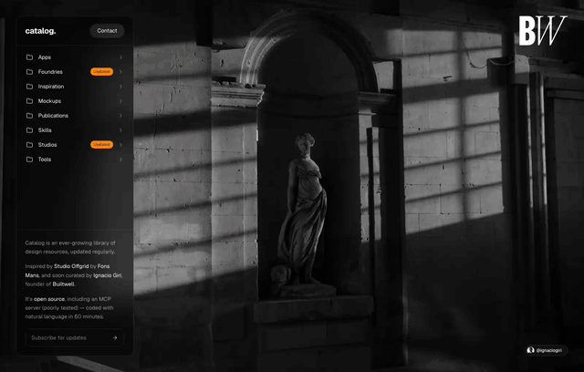

# Catalog

A three-column browser for a design-resource library — categories, items, and a
detail panel, with state driven entirely by the URL.

Built by [Ignacio Giri](https://ignaciogiri.vercel.app) at
[Builtwell](https://builtwell.design).

[](https://catalog.builtwell.design)

## Stack

- **Next.js 16.3.2** (App Router, Turbopack, Cache Components, Partial
  Prefetching, React Compiler)
- **Tailwind CSS v4**
- **Base UI** primitives + `lucide-react`
- **Drizzle ORM** on **Neon** Postgres
- **Bun** as package manager and script runner
- **Ultracite** (Biome) for linting and formatting
- **motion** for the panel open/close animations
- **Vercel Blob** for item image hosting (optional)

## Project structure

```
app/                     routes only — one folder per URL segment
  layout.tsx             root chrome: backdrop, header, categories column
  [category]/            + items column
    [item]/              + detail column
  sitemap.ts robots.ts

components/
  ui/                    shadcn primitives (generated — don't hand-edit)
  panels/                the Miller-column machinery: enter/exit, widths
  catalog/               content and navigation: rows, breadcrumb, detail
  site/                  chrome around the catalog: subscribe, contact, credit

hooks/
  use-panel-widths.ts    viewport -> column widths (the one client-side layout input)

lib/
  db/                    schema.ts, queries.ts, and the Drizzle client
  actions.ts             server actions
  site.ts                name, urls, contact — everything about the site itself
  layout.ts              column widths and the columns/stack breakpoint
  utils.ts

mcp/                     read-only MCP server: tools.ts + stdio server.ts
scripts/                 mirror-assets.ts — one-shot CLI tasks
```

Three rules keep it that way:

1. **`app/` holds routes, nothing else.** Anything reusable moves to `components/`.
2. **Imports point down.** `app/` -> `components/` -> `hooks/`, `lib/`. Nothing in
   `lib/` or `components/` imports from `app/`.
3. **Every database read lives in `lib/db/queries.ts`,** cached and tagged in one
   place, so caching is one file to reason about.

## Getting started

```bash
git clone https://github.com/ignaciogiri/builtwell-catalog.git
cd builtwell-catalog
bun install
cp .env.example .env.local   # then fill in DATABASE_URL
bun run db:push              # create the tables
bun run dev                  # http://localhost:6267
```

Only `DATABASE_URL` is required. Get one free at [neon.tech](https://neon.tech).

The catalog content lives in the database, not in this repo, so `db:push`
leaves you with empty tables to fill with your own rows. To browse the real
catalog instead, point an agent at the hosted MCP server below, which needs
nothing from you.

## Scripts

| Script | What it does |
| --- | --- |
| `bun run dev` | Dev server on port 6267 ("MANS" on a phone keypad) |
| `bun run build` / `start` | Production build and serve |
| `bun run db:push` | Push the Drizzle schema to Postgres |
| `bun run db:studio` | Drizzle Studio |
| `bun run db:mirror` | Upload item images to Vercel Blob (optional) |
| `bun run mcp` | Read-only MCP server over the catalog, on stdio |
| `bun run check` | Lint and format check ([Ultracite](https://www.ultracite.ai) over Biome) |
| `bun run fix` | Apply every safe lint and format fix |

## Editing the catalog

There is no seed file, no admin panel, and no CMS. The database is the only
source of truth, and I update it by talking to it.

The workflow is Claude Code with the Neon MCP server connected. I describe the
change in plain language and it writes the SQL. Adding an item, retagging a
batch, renaming a badge on every row that carries it: each one is a sentence
rather than a migration.

Pages are prerendered, so a change is live after the next deploy rather than
immediately.

That is also why this repo ships no catalog data. The content lives in Postgres,
the code lives here, and the two only meet at `lib/db/queries.ts`.

## Routing

Nested segments map onto the Miller columns, so each panel is a layout level:

```
/                          categories
/studios                   categories + items
/studios/pentagram         categories + items + detail
```

Every catalog URL is fully prerendered at build time via `generateStaticParams`
and served as static HTML — no database reads on the request path. Partial
prerendering only ever engages for a slug that is not in the catalog, which
404s anyway.

Reads are cached with `use cache` for a day. Nothing invalidates them yet, so a
row edited in the database shows up on the next deploy — or a day later,
whichever comes first. The queries already carry `cacheTag`s, so wiring
`revalidateTag` to a Neon webhook later is the obvious next step.

On mobile the stack collapses to a single panel with a breadcrumb.

## Navigation

Navigating never touches the network. The whole catalog is ~56 KB, so it ships
once with the shell and all three columns render from a single persistent
client component — panels change props rather than swapping a route slot.
Measured on a production build: 8ms to switch item, 28ms to open the detail
panel, zero blocking requests.

The routes still exist underneath, which is what keeps every URL prerendered
and independently shareable.

A few things keep it that way:

- **[Partial Prefetching](https://nextjs.org/docs/app/guides/adopting-partial-prefetching)**
  prefetches one shared App Shell per route rather than a payload per link.
- **Hover-triggered prefetch** on the item rows. A category can hold a
  hundred-plus links, and prefetching each one as it scrolls into view spends
  requests on navigations that mostly never happen. The eight category rows
  stay eager.
- **`instant = false`** on the two dynamic segments. Neither renders UI of its
  own, so wrapping them in `<Suspense>` would put a boundary around a component
  that returns `null`. Every real URL is prerendered, so the blocking path only
  exists for a slug that is not in the catalog — which is there to 404.
- **[React Compiler](https://react.dev/learn/react-compiler)** memoizes
  automatically, so there is no hand-written `useMemo` or `useCallback`.
- **`inlineCss`** saves a stylesheet round trip on first paint.

## MCP server

The catalog is exposed to AI agents over MCP. Every tool is a `SELECT` and
there is no write path, so it is safe to point at production.

### Use the hosted server

Nothing to install and no database of your own. The deployment holds the
credentials; you just connect to it.

```bash
claude mcp add --transport http catalog https://catalog.builtwell.design/api/mcp
```

Or add it to any MCP client's config:

```json
{
  "mcpServers": {
    "catalog": {
      "type": "http",
      "url": "https://catalog.builtwell.design/api/mcp"
    }
  }
}
```

This repo ships exactly that as `.mcp.json`, so in Claude Code it is offered
automatically from the project root, cloned or not.

### Tools

| Tool | Purpose |
| --- | --- |
| `list_categories` | Categories with item counts |
| `list_items` | Items, optionally filtered by category |
| `get_item` | One item with full detail and tags |
| `search_items` | Case-insensitive search over names and descriptions |
| `list_tags` | Tags with item counts |
| `items_by_tag` | Every item carrying a tag |

### Run it locally

Against your own database, over stdio, with `DATABASE_URL` from `.env.local`:

```bash
claude mcp add catalog -- bun run /absolute/path/to/mcp/server.ts
```

Both transports register the same tools from `mcp/tools.ts`:

```
mcp/tools.ts           the six tools, defined once
mcp/server.ts          stdio      -> local, needs DATABASE_URL
app/api/mcp/route.ts   http       -> hosted, needs nothing
```

## Questions

Email [nacho@builtwell.design](mailto:nacho@builtwell.design).

## Credits

Content is indexed from [catalog.design](https://catalog.design), curated by
[Studio Offgrid](https://offgrid.inc). This repo is an independent
reimplementation — all catalog entries belong to their respective owners.

## License

[0BSD](./LICENSE) © Ignacio Giri

Use it as you please, no attribution required.
